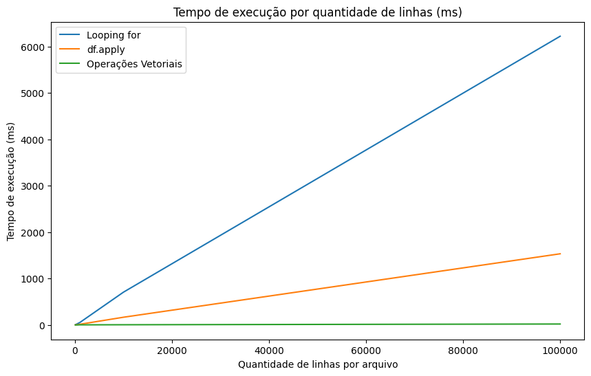
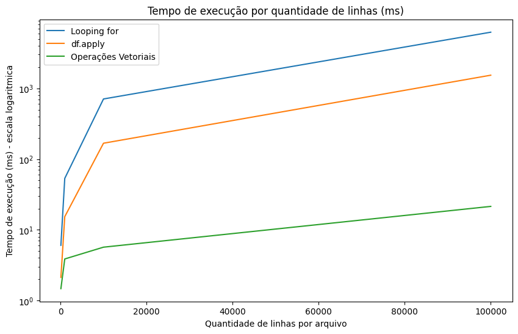

# Tempo De Execucao de Operação em Dataframe

== Em desenvolvimento ==

## Descrição
Este projeto tem como objetivo medir o tempo de execução de ações em um DataFrame utilizando Python e bibliotecas como Pandas. Com isso determinar a melhor maneira de realizar operações em Dataframe.

## Estrutura do Projeto
- `source/`: Contém o código fonte do projeto.
- `source/data/`: Contém os dados utilizados para os testes.
- `source/results/`: Contém os resultados da análise em gráficos.
- `source/README.md`: Arquivo com informações sobre o projeto.

## Requisitos
- Python 3.x
- Pandas
- Jupyter Notebook

## Instalação
1. Clone o repositório:
    ```bash
    git clone https://github.com/seu-usuario/TempoDeExecucaoAcaoDataframe.git
    ```
2. Navegue até o diretório do projeto:
    ```bash
    cd TempoDeExecucaoAcaoDataframe
    ```
3. Instale as dependências:
    ```bash
    pip install -r requirements.txt
    ```

## Uso
1. Execute os notebooks Jupyter para visualizar as análises:
    ```bash
    jupyter notebook
    ```
2. Execute o script principal:
    ```bash
    python src/main.py
    ```

## Análise dos Resultados
Os resultados obtidos mostram o tempo de execução de diferentes métodos para realizar uma operação simples em um Dataframe, neste caso identificar pagamentos com mais de cinco dias de atraso. Para realizar a operação basta identificar as duas colunas de data, data do pagamento e data do vencimento, calcular a diferença entre as datas e, por fim, definir se é maior ou menor que cinco dias.

Três métodos foram comparados:

1. **Looping `for`**: Este método é o mais lento, especialmente para grandes quantidades de dados, devido à sua natureza iterativa.
2. **`df.apply`**: Este método é mais rápido que o looping `for`, pois aplica uma função a cada linha do DataFrame de forma mais eficiente.
3. **Operações vetoriais**: Este é o método mais rápido, aproveitando as operações vetoriais do Pandas para realizar cálculos em massa.

Os gráficos gerados mostram claramente que as operações vetoriais são significativamente mais rápidas, especialmente à medida que o tamanho do DataFrame aumenta. Abaixo estão os gráficos que ilustram esses resultados:




### Tabela de Resultados

| Quantidade de Linhas | Looping `for` (ms) | `df.apply` (ms) | Operações Vetoriais (ms) |
|----------------------|--------------------|-----------------|--------------------------|
| 100                  | 5.497584           | 1.774357        | 0.715097                 |
| 1000                 | 54.975844          | 17.743574       | 7.150965                 |
| 10000                | 549.758440         | 177.435740      | 71.509650                |
| 100000               | 5497.584400        | 1774.357400     | 715.096500               |

### Tabela de Redução de Tempo em porcentagem com referencia no Looping `for`

| Quantidade de Linhas | Redução `df.apply` (%) | Redução Operações Vetoriais (%) |
|----------------------|------------------------|---------------------------------|
| 100                  | 64.79                  | 75.59                           |
| 1000                 | 71.22                  | 92.74                           |
| 10000                | 76.32                  | 99.20                           |
| 100000               | 75.34                  | 99.66                           |

## Contribuição
1. Faça um fork do projeto.
2. Crie uma nova branch:
    ```bash
    git checkout -b minha-nova-feature
    ```
3. Faça suas alterações e commit:
    ```bash
    git commit -m 'Adiciona nova feature'
    ```
4. Envie para o repositório remoto:
    ```bash
    git push origin minha-nova-feature
    ```
5. Abra um Pull Request.

## Licença
Este projeto está licenciado sob a Licença MIT. Veja o arquivo [LICENSE](LICENSE) para mais detalhes.
